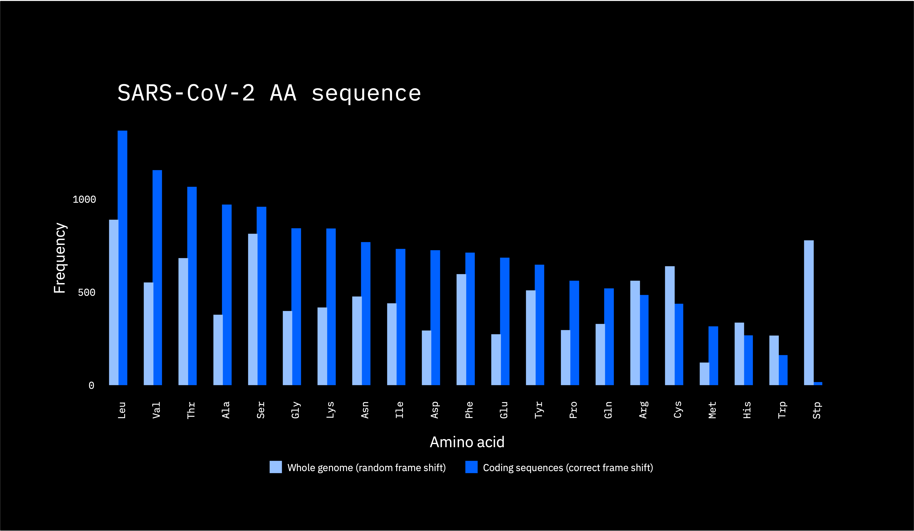

# Homework 1
The main objectives this homework were, for both a whole genome (no introns spliced out) and a set of separate genes, to:
1. Count codons in the DNA sequence
2. Translate those codons into amino acids
3. Count the amino acids
4. Visualize the 2 sets of counts, contrasting the whole genome counts against the separate gene counts for both (1) and (3).

## Getting started
* Make sure to install the packages with the versions pinned from the `requirements.txt` file. This can be done by running `pip install -r requirements.txt` in the terminal.
* Next, upload the .fna files for the whole genome and separate genes for the same specimen that should be compared/contrasted.
* To produce the csv outputs for the homework (steps 2 and 4), run these commands in the terminal (also included in `run_count_codons`):  
`python count_codons.py 'SARS-CoV-2_whole_genome.fna' 'whole_genome_output.csv'`  
`python count_codons.py 'SARS-CoV-2_separate_genes.fna' 'separate_genes_output.csv'`

* Optionally, the counts for the fake (test) data for step 3 of the homework can be produced by running this command in the terminal (again, included in `run_count_codons`):  
`python count_codons.py 'fake_genome.fna' 'fake_genome_actual_output.csv'`
  * Note that the fake data was produced by running the `create_test_sequence.py` file.

## Homework instructions
The original instructions for the homework are included in a pdf file called `ancillary/hw1_instructions.pdf`.

## Deliverables
- [X] Well-commented code for step 2: `count_codons.py`
- [X]  The fake genome, expected result (csv), and your program's output in step 3 (csv): `data/inputs/fake_genome.fna`, `data/outputs/fake_genome_actual_output.csv`, `data/outputs/fake_genome_expected_output.csv`
- [X] The output CSV files in step 4: `separate_genes_output.csv`, `whole_genome_output.csv`
- [X] The output figures for steps 5 and 6: `vizzes/codon_counts.png`, `vizzes/aa_counts.png`
- [X] The answer to question 7 in txt/doc/pdf: `ancillary/question7.txt`

The csv files output as a result of running the commands in the 3rd bullet of the "Getting started" section are:
* separate_genes_output.csv
* whole_genome_output.csv

These were visualized using ggplot and svglite in R, with some small aesthetic enhancements made to the raw svg file afterwards. They were then converted to png files. They're displayed below.

