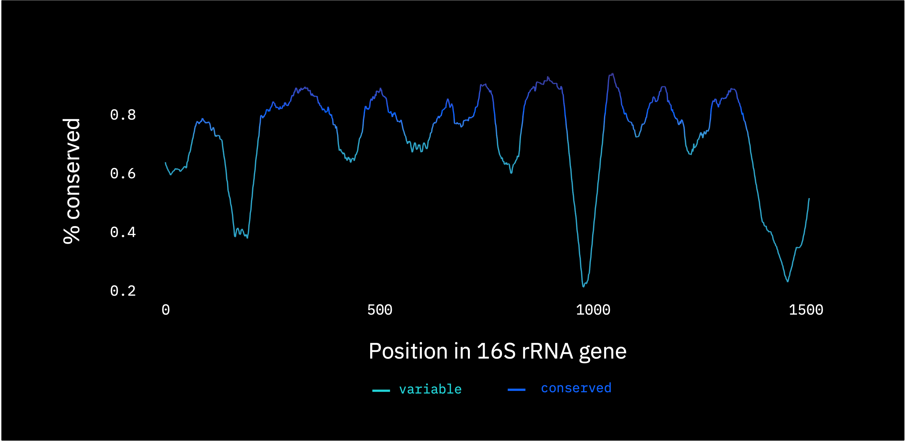

# Homework 4
The main objective for this homework was to "identify variable regions in amplicon sequences/marker genes, and to compare those results to the conventional wisdom about the locations of variable regions" (see "Background" of `ancillary/hw4_instructions.pdf`).

## Getting started
The source code for this homework is in hw4.py. Note that the `.py` extension is a slight misnomer - it's actually a Databricks python notebook, which differs from a python script in that it allows use of the SQL, R and markdown languages (in addition to Python) via Databricks magic. Each line of a Databricks magic cell show up prefixed with "# MAGIC" - which is converted to the correct language (indicated with a % e.g. %r or %sql) automatically in Databricks (i.e. these cells are actually executed, even though they look like comments). In this homework, I use SQL for data pre-processing, Python for algorithms or more sophisticated operations, and R for visualization, so Databricks' interoperability comes in handy. Each section of the homework is delineated with a markdown cell indicating which problem (1, 2, 3, 4) to which the subsequent code pertains.

## Deliverables

Amongst other things, deliverables included a couple visualizations:

![](img/solution-problem-2.png

